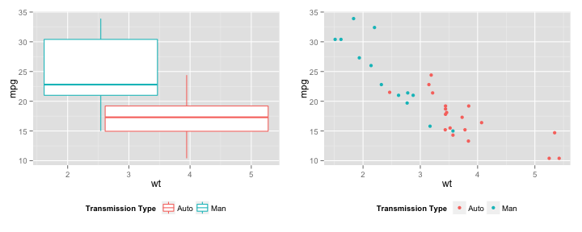

# Regression Models Course Project Report
## Martin Hediger

To do:
- Box-Scat: Increase axis font size, correct axis labels 

### Exploratory Analysis
As an initial test, dependence of `mpg` on `wt` is analysed.
`multiplot` function defined [here](https://github.com/mzhKU/regmods_course_project/blob/master/multiplot.R).

Fig. [`box-scat`](https://github.com/mzhKU/regmods_course_project/blob/master/box-scat.R)

 

The boxplot shows that most likely the automatic cars have lower MPG (and possibly lower variance in the data).

### Research questions:
1 mpg: Better with automatic or manual?  
2 Quantify mpg difference between automatic and manual transmissions 

### Requirements:
- PDF/R markdown
- ~2 pages main text
- Supporting figures in appendix up to total of 5 pages max (sup + main)
- Appendix: Only figures
- Executive summary
- Upload PDF  

### Criteria:
- Interpretation of coefficients
- Exploratory analysis
- Fit of multiple models and detail strategy for model selection
- Question of interest addressed/Reason why question is not answerable
- Residual plot, diagnostics
- Uncertainty quantification in conclusions/correct inference
- Report briefness
- Executive summary
- Rmd
